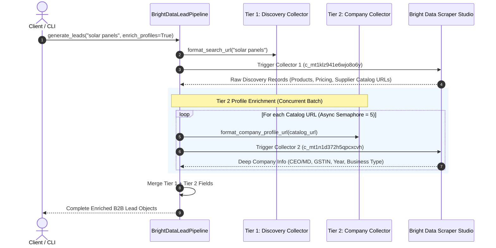
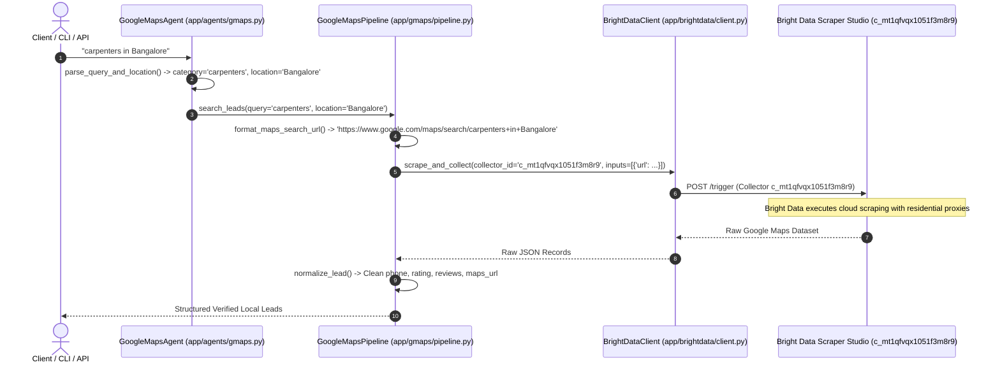
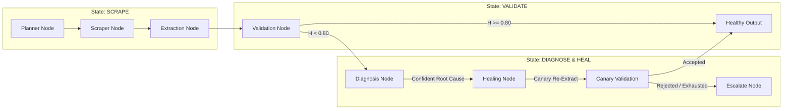
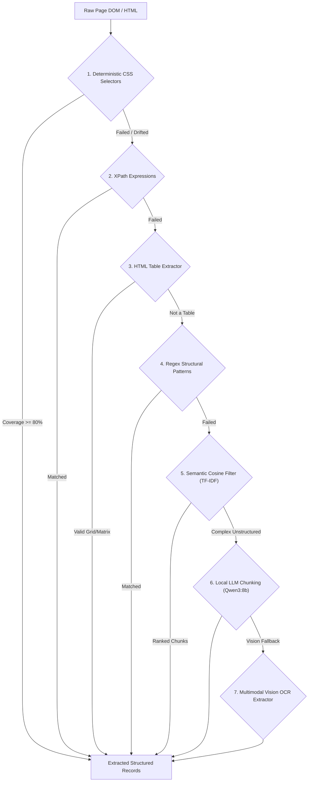
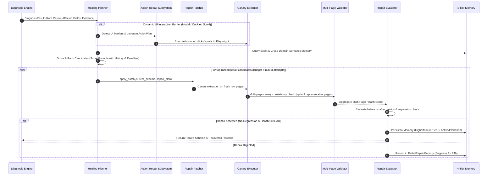

# Scrape the Verse — Multi-Engine Scraping & Intelligence Architecture 🌌

This document provides a comprehensive technical breakdown of the three core scraping engines implemented in the **Scrape the Verse** repository:
1. **Bright Data Cloud Subsystem (`MicroServices/leadfinder/brightdata/`)** — 2-Tier B2B Lead Intelligence & Cloud Fast-Path.
2. **Google Maps Local Lead Subsystem (`MicroServices/leadfinder/gmaps/` & `MicroServices/leadfinder/agents/gmaps.py`)** — Localized business discovery, phone harvesting, and rating extraction.
3. **Native Multi-Agent & Autonomous Self-Healing Engine (`MicroServices/leadfinder/crawler/`, `MicroServices/leadfinder/extraction/`, `MicroServices/leadfinder/validation/`, `MicroServices/leadfinder/diagnosis/`, `MicroServices/leadfinder/healing/`, `MicroServices/leadfinder/graph/`)** — LangGraph state machine, stealth Playwright crawling, cascading multi-strategy extraction, deterministic validation, and 4-tier closed-loop self-healing.

---

## 🏗️ 1. High-Level System Architecture & Smart Router

```mermaid
flowchart TD
    UserReq["User Scraping Query / API Request / CLI"] --> Router{"Smart Dual-Engine Router (app/main.py / cli.py)"}

    %% Engine 1: Bright Data
    Router -->|B2B Query / 'Indiamart' / --leads| B2B["🏢 Engine 1: Bright Data Pipeline (app/brightdata/)"]
    B2B --> BD_T1["Tier 1: Discovery Collector\n(c_mt1klz941e6wjo8o6y)"]
    BD_T1 --> BD_T2["Tier 2: Concurrent Profile Enrichment\n(c_mt1n1d372h5qpcxcvh)"]
    BD_T2 --> Out_B2B["Enriched B2B Leads\n(Company, Contact, GSTIN, Catalog)"]

    %% Engine 2: Google Maps
    Router -->|Local Places / Map Search / --maps| GMaps["📍 Engine 2: Google Maps Subsystem (app/gmaps/)"]
    GMaps --> GMaps_NLP["Query & Location NLP Parser\n(app/agents/gmaps.py)"]
    GMaps_NLP --> GMaps_Col["Bright Data Maps Collector\n(c_mt1qfvqx1051f3m8r9)"]
    GMaps_Col --> GMaps_Norm["Field Normalizer & Filter\n(Phone, Rating, Website, Map URL)"]
    GMaps_Norm --> Out_GMaps["Local Leads & Places"]

    %% Engine 3: Native Self-Healing Engine
    Router -->|Target URLs / Fallback / --engine local| Native["🤖 Engine 3: Native LangGraph Engine (app/graph/)"]
    
    subgraph MultiAgentLoop ["Native 6-Node Self-Healing LangGraph Pipeline"]
        Planner["1. Planner Agent\n(Ollama Qwen3:8b)"] --> ScraperNode["2. Scraper Agent\n(Playwright Stealth / Concurrency)"]
        ScraperNode --> ExtractorNode["3. Extraction Engine\n(CSS / XPath / Table / LLM / Semantic)"]
        ExtractorNode --> ValidatorNode["4. Validation Engine\n(Deterministic Health Score H)"]
        
        ValidatorNode -->|H >= 0.80 (Healthy)| EndNode["Success Output"]
        ValidatorNode -->|H < 0.80 (Degraded/Broken)| DiagnosisNode["5. Diagnosis Agent\n(Root Cause & Evidence Analysis)"]
        
        DiagnosisNode -->|Confident Root Cause| HealingNode["6. Self-Healing Loop\n(Planner, Action Repair, Canary, Patcher)"]
        DiagnosisNode -->|Low Confidence / Unrecoverable| EscalateNode["Escalate & Fallback"]
        
        HealingNode -->|Canary Accepted & Multi-Page Verified| EndNode
        HealingNode -->|Attempts Exhausted| EscalateNode
    end
    
    Native --> MultiAgentLoop
```

---

## ⚡ 2. Engine 1: Bright Data Cloud Pipeline Subsystem (`MicroServices/leadfinder/brightdata/`)

The **Bright Data Subsystem** provides enterprise-grade, high-throughput cloud scraping and chained B2B supplier intelligence without local browser overhead.

### 2.1 Component Structure
- [`MicroServices/leadfinder/brightdata/client.py`](file:///c:/Projects/Scrape_the_Verse/app/brightdata/client.py): Async HTTP REST client for Bright Data Scraper Studio. Handles job triggering (`/trigger`), asynchronous status polling (`/progress`), dataset snapshot retrieval, timeout controls, and automated fallback to the Bright Data CLI runner (`scrape_via_cli`).
- [`MicroServices/leadfinder/brightdata/pipeline.py`](file:///c:/Projects/Scrape_the_Verse/app/brightdata/pipeline.py): Implements the **2-Tier Chained B2B Lead Generation Pipeline**.
- [`MicroServices/leadfinder/brightdata/service.py`](file:///c:/Projects/Scrape_the_Verse/app/brightdata/service.py): Service orchestration layer integrating tasks, URL query formatting, error handling, and lead export formatting.
- [`MicroServices/leadfinder/brightdata/adapter.py`](file:///c:/Projects/Scrape_the_Verse/app/brightdata/adapter.py): Fallback adapter allowing the native Scraper agent to route requests to Bright Data when anti-bot obstacles or CAPTCHAs are encountered.
- [`MicroServices/leadfinder/brightdata/exceptions.py`](file:///c:/Projects/Scrape_the_Verse/app/brightdata/exceptions.py): Domain-specific exception hierarchy (`BrightDataAuthError`, `BrightDataConfigError`, `BrightDataJobError`, `BrightDataTimeoutError`, `BrightDataEmptyResultError`).

### 2.2 2-Tier Chained Pipeline Flow


### 2.3 Extracted Data Schema
| Field | Type | Description | Source |
|---|---|---|---|
| `company_name` | `string` | Legal registered business name | Tier 1 & 2 |
| `product_title` | `string` | Specific product/service offering | Tier 1 |
| `price` | `string / dict` | Price string or structured `{symbol, value, currency}` | Tier 1 |
| `contact_person` | `string` | Business owner, CEO, or Managing Director | Tier 2 |
| `gstin` | `string` | Verified Tax ID / GSTIN number | Tier 2 |
| `established_year`| `string / int` | Registration year of company | Tier 2 |
| `nature_of_business`| `string` | Manufacturer, Wholesaler, Exporter, Trader | Tier 2 |
| `city` / `state` | `string` | Operational location & headquarters | Tier 1 & 2 |
| `company_catalog_url` | `string` | Online store or catalog URL | Tier 1 |

---

## 📍 3. Engine 2: Google Maps Local Lead Subsystem (`MicroServices/leadfinder/gmaps/`)

The **Google Maps Subsystem** is a specialized intelligence pipeline **powered directly by Bright Data's Scraper Studio** (`c_mt1qfvqx1051f3m8r9`). It leverages Bright Data's rotating residential proxy network to harvest localized business listings, public contact numbers, star ratings, review counts, websites, and Google Maps place links without getting blocked or rate-limited.



### 3.1 Bright Data Collector Details
- **Collector ID**: `c_mt1qfvqx1051f3m8r9` (Configurable via `BRIGHTDATA_GMAPS_COLLECTOR_ID` in `.env`).
- **Input Parameter**: Google Maps Search URL (`https://www.google.com/maps/search/...`).
- **Execution Mechanism**: Async REST polling with automatic fallback to the Bright Data CLI runner (`scrape_via_cli`).
- **Cloud Infrastructure**: Cloud unblocking, dynamic JS rendering, and residential proxy rotation managed on Bright Data.

### 3.2 Component Structure
- [`MicroServices/leadfinder/gmaps/pipeline.py`](file:///c:/Projects/Scrape_the_Verse/app/gmaps/pipeline.py): Maps search URL formatter (`format_maps_search_url`), Bright Data collector trigger (`c_mt1qfvqx1051f3m8r9`), and data normalizer (`normalize_lead`).
- [`MicroServices/leadfinder/gmaps/service.py`](file:///c:/Projects/Scrape_the_Verse/app/gmaps/service.py): High-level async interface (`get_local_leads`) managing search execution, result validation, and caching.
- [`MicroServices/leadfinder/agents/gmaps.py`](file:///c:/Projects/Scrape_the_Verse/app/agents/gmaps.py): Intelligent agent wrapper with natural language parsing (`parse_query_and_location`) that decomposes unstructured queries (e.g. `"best dentists near Bangalore East"`) into `category="dentists"` and `location="Bangalore East"`.

### 3.3 Field Normalization Engine
Google Maps search results vary by business category. The normalizer handles:
- **Phone Numbers**: Extracts sanitized national and international dialing codes (e.g. `+91 99806 00167`) from `phone_number`, `phone`, `contact_number`, or `tel`.
- **Ratings & Reviews**: Normalizes localized numeric formats (e.g. `"4,8"` or `4.8`) into standard IEEE floats and integer review counts.
- **Websites & URLs**: Filters out invalid placeholders (`"#"`, `"null"`, `"None"`).

### 3.4 CLI & API Execution
- **CLI**:
  ```bash
  python cli.py "carpenters in Bangalore" --maps -o carpenters.json -f json
  python cli.py "plumbers in Chennai" --maps -o plumbers.csv -f csv
  ```
- **REST API**:
  ```http
  POST /api/v1/gmaps/leads
  Content-Type: application/json

  {
    "query": "electricians in Hyderabad"
  }
  ```

---

## 🤖 4. Engine 3: Native Multi-Agent & Autonomous Self-Healing Engine

The **Native Engine** is an autonomous, closed-loop scraping system built on **LangGraph**, **Playwright**, and **local Ollama (Qwen3:8b)** that diagnoses extraction degradation in real-time and repairs itself without human intervention.



---

### 4.1 LangGraph State Machine Architecture (`MicroServices/leadfinder/graph/`)
State is strictly isolated per scraping job using [`ScrapingGraphState`](file:///c:/Projects/Scrape_the_Verse/app/graph/state.py):
- **`task_id`**: UUID4 tracking the job across all agent nodes and threads.
- **`raw_results`**: Unmodified raw HTML payloads captured by Playwright.
- **`extracted_results`**: Structured JSON dictionaries generated by extraction strategies.
- **`validation_result`**: Deterministic metrics and health scores.
- **`diagnosis_result`**: Root cause and evidence categorization.
- **`repair_history`**: Audit trail of all attempted patches, before/after metrics, and confidence tiers.

---

### 4.2 Cascading Extraction Engine (`MicroServices/leadfinder/extraction/`)
The extraction engine executes a resilient cascade across multiple strategies:


---

### 4.3 Deterministic Validation Subsystem (`MicroServices/leadfinder/validation/`)
Validation does **not** use fuzzy LLM guessing. It uses deterministic mathematical formulas:

$$\text{Health Score } H = w_{\text{cov}} \cdot C_{\text{field}} + w_{\text{dup}} \cdot (1 - R_{\text{dup}}) + w_{\text{url}} \cdot U_{\text{valid}} + w_{\text{sch}} \cdot S_{\text{valid}}$$

- **Completeness Validator** ([`completeness.py`](file:///c:/Projects/Scrape_the_Verse/app/validation/completeness.py)): Calculates per-field fill rate, detecting empty strings, nulls, and placeholder values (`"N/A"`, `"-"`, `"TBD"`).
- **Duplicate Validator** ([`duplicates.py`](file:///c:/Projects/Scrape_the_Verse/app/validation/duplicates.py)): Computes duplicate record ratios and flags duplicate explosions (common when pagination or CSS selectors break).
- **Schema & Type Validator** ([`schema.py`](file:///c:/Projects/Scrape_the_Verse/app/validation/schema.py)): Verifies primitive data types (`string`, `number`, `boolean`, `array`) against expected field models.
- **Anomaly Detector** ([`anomalies.py`](file:///c:/Projects/Scrape_the_Verse/app/validation/anomalies.py)): Flags zero-record anomalies, severe coverage drops ($>40\%$), and baseline deviations.

---

### 4.4 Evidence-Grounded Diagnosis Engine (`MicroServices/leadfinder/diagnosis/`)
When $H < 0.80$, the diagnosis engine inspects validation failure evidence, raw HTML tags, and error metrics to categorize the precise failure:
- **`SELECTOR_DRIFT`**: Target DOM elements changed classes/IDs while content remains present.
- **`DOM_STRUCTURE_CHANGE`**: Hierarchy shifted (e.g. `div > div` changed to `section > article`).
- **`TABLE_STRUCTURE_CHANGE`**: Table column headers or layout altered.
- **`ANTI_BOT_CHALLENGE`**: Cloudflare, DataDome, or CAPTCHA interstitial detected.
- **`PAGINATION_BROKEN`**: Next page link selector or dynamic click trigger failed.
- **`DYNAMIC_CONTENT_UNRENDERED`**: JavaScript SPA client-side rendering was delayed or unhydrated.
- **`SOURCE_DATA_QUALITY`**: Upstream website is genuinely missing data (healing is bypassed).

---

### 4.5 Closed-Loop Self-Healing Subsystem (`MicroServices/leadfinder/healing/`)
The self-healing subsystem automatically repairs broken scraper configurations through a 5-step lifecycle:



#### 4-Tier Self-Healing Memory Subsystems:
1. **Exact Signature Memory ([`memory.py`](file:///c:/Projects/Scrape_the_Verse/app/healing/memory.py))**: Generates deterministic SHA-256 signatures from `(domain + tag_distribution + field_names)` to instantly apply 0ms cached repairs on identical DOM states.
2. **Cross-Domain Semantic Memory ([`semantic_memory.py`](file:///c:/Projects/Scrape_the_Verse/app/healing/semantic_memory.py))**: Extracts abstract structural patterns (e.g. grid card hierarchies, product containers) and transfers proven selectors across different domains.
3. **Failed Repair Memory ([`failed_memory.py`](file:///c:/Projects/Scrape_the_Verse/app/healing/failed_memory.py))**: Records rejected patches with a 24-hour TTL and applies penalty scores to prevent repeating unsuccessful repair strategies.
4. **Persistent SQLite WAL Storage ([`persistent_memory.py`](file:///c:/Projects/Scrape_the_Verse/app/healing/persistent_memory.py))**: Saves all successful and failed repairs to local SQLite with Write-Ahead Logging for cross-session and cross-process persistence.

---

## 📊 5. Scraping Engines Comparison Matrix

| Feature / Dimension | 🏢 Engine 1: Bright Data | 📍 Engine 2: Google Maps | 🤖 Engine 3: Native LangGraph |
|---|---|---|---|
| **Primary Use Case** | B2B directory & supplier discovery (IndiaMART, wholesale) | Local service contractors, shops, ratings, contact discovery | Arbitrary websites, dynamic SPAs, e-commerce, custom targets |
| **Execution Environment** | Cloud Scraper Studio collectors | Cloud Google Maps search collectors | Local Playwright Chromium + Ollama Qwen3:8b |
| **Average Latency** | 4 – 10 seconds | 3 – 8 seconds | 5 – 25 seconds (includes full validation & LLM) |
| **Anti-Bot Resilience** | High (Cloud proxy rotating residential networks) | High (Cloud unblockers) | High (Playwright stealth + dynamic action repair) |
| **Self-Healing Capability** | Upstream maintained by Bright Data | Upstream maintained by Bright Data | Full local 4-tier closed-loop self-healing |
| **Field Enrichment** | 2-Tier: Discovery + Deep Company Profile (GSTIN, CEO) | Single-pass search listing normalization | Multi-strategy cascading extraction (CSS, XPath, LLM) |
| **CLI Flag** | `--leads` | `--maps` | `--engine local` or standard query |
| **API Endpoint** | `POST /api/v1/brightdata/leads` | `POST /api/v1/gmaps/leads` | `POST /scrape` or `POST /api/v1/jobs` |

---

## 🛠️ 6. Quick Reference & CLI Cheat Sheet

```bash
# 1. Google Maps Local Lead Discovery
python cli.py "carpenters in Bangalore" --maps
python cli.py "plumbers in Chennai" --maps -o plumbers.csv -f csv

# 2. 2-Tier B2B Supplier Intelligence
python cli.py "solar panels in Delhi" --leads -o solar_suppliers.json -f json
python cli.py "packaging boxes in Mumbai" --leads

# 3. Native Multi-Agent Self-Healing Engine
python cli.py "Extract news titles" -u "https://news.ycombinator.com" --engine local
python cli.py "Extract product prices" -u "https://books.toscrape.com" -o products.csv -f csv

# 4. Verify Health & System Readiness
python cli.py --check-brightdata
pytest -k "not live"
```
