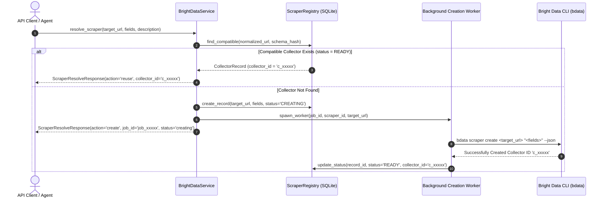
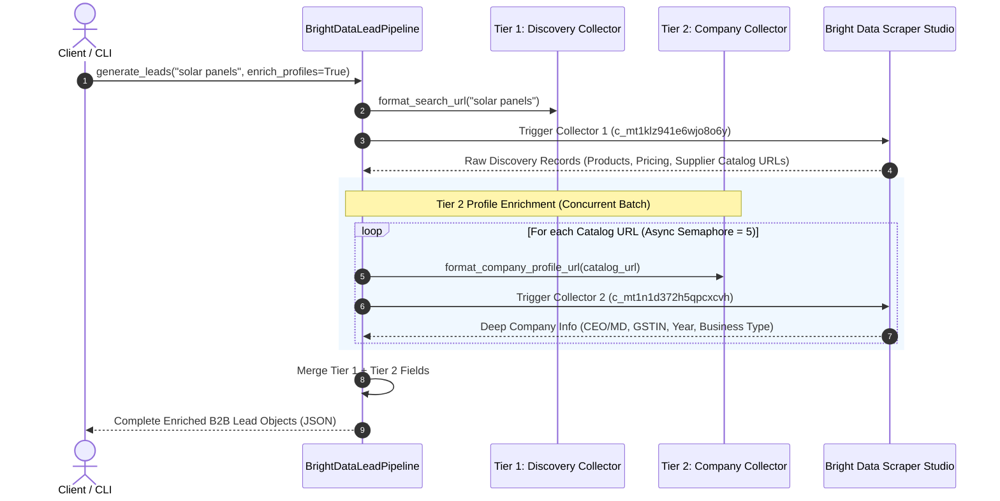
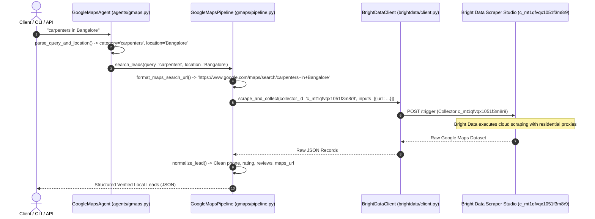
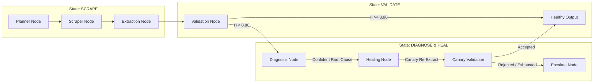

# Scrape the Verse — Multi-Engine Scraping & Intelligence Architecture 🌌

This document provides a comprehensive technical breakdown and operational guide for the core scraping engines implemented in the **LeadFinder** microservice:
1. **Bright Data Cloud Subsystem (`MicroServices/leadfinder/brightdata/`)** — Scraper Studio CLI integration, 2-Tier B2B lead intelligence, dynamic scraper resolution, and automated self-healing.
2. **Google Maps Local Lead Subsystem (`MicroServices/leadfinder/gmaps/` & `MicroServices/leadfinder/agents/gmaps.py`)** — Localized business discovery, phone harvesting, rating extraction, and website capture.
3. **Native Multi-Agent & Autonomous Self-Healing Engine (`MicroServices/leadfinder/crawler/`, `MicroServices/leadfinder/extraction/`, `MicroServices/leadfinder/validation/`, `MicroServices/leadfinder/diagnosis/`, `MicroServices/leadfinder/healing/`, `MicroServices/leadfinder/graph/`)** — LangGraph state machine, stealth crawling, cascading multi-strategy extraction, deterministic validation, and 4-tier closed-loop self-healing.

---

## 🏗️ 1. High-Level System Architecture & Smart Router

```mermaid
flowchart TD
    UserReq["User Scraping Query / API Request / CLI / Agent"] --> Router{"Smart Engine Router (main.py / cli.py)"}

    %% Engine 1: Bright Data & Scraper Studio
    Router -->|Directory / URL Target| Resolver["Smart Resolver (BrightDataService)"]
    Resolver --> Check{"Compatible in Registry?"}
    Check -->|Yes: Status READY| Reuse["Reuse Collector (c_xxxxx)"]
    Check -->|No| Create["Spawn Async Creation Job\n(bdata scraper create)"]
    Create --> Registry[".brightdata_registry.sqlite"]
    Reuse --> RunCollector["Run Collector (POST /scrapers/run)"]

    %% Self Healing
    RunCollector -->|DOM Changed / Extraction Failed| Heal["Trigger Self-Healing\n(bdata scraper heal)"]
    Heal -->|Preserve c_xxxxx| RunCollector

    %% Engine 2: Google Maps & B2B
    Router -->|B2B Query / 'Indiamart' / --leads| B2B["2-Tier B2B Pipeline\n(Discovery + Concurrent Enrichment)"]
    Router -->|Local Places Query / --maps| GMaps["Google Maps Subsystem\n(Collector c_mt1qfvqx1051f3m8r9)"]

    %% Engine 3: Native Self-Healing Engine
    Router -->|Target URLs / Fallback / --engine local| Native["🤖 Engine 3: Native LangGraph Engine (graph/)"]
    
    subgraph MultiAgentLoop ["Native 6-Node Self-Healing LangGraph Pipeline"]
        Planner["1. Planner Agent\n(Ollama Qwen3:8b)"] --> ScraperNode["2. Scraper Agent\n(Playwright Stealth / Concurrency)"]
        ScraperNode --> ExtractorNode["3. Extraction Engine\n(CSS / XPath / Table / LLM / Semantic)"]
        ExtractorNode --> ValidatorNode["4. Validation Engine\n(Deterministic Health Score H)"]
        
        ValidatorNode -->|H >= 0.80 (Healthy)| EndNode["Success Output"]
        ValidatorNode -->|H < 0.80 (Degraded/Broken)| DiagnosisNode["5. Diagnosis Agent\n(Root Cause & Evidence Analysis)"]
        
        DiagnosisNode -->|Confident Root Cause| HealingNode["6. Self-Healing Loop\n(Planner, Action Repair, Canary, Patcher)"]
        DiagnosisNode -->|Low Confidence / Unrecoverable| EscalateNode["Escalate & Fallback"]
        
        HealingNode -->|Canary Accepted & Multi-Page Verified| EndNode
        HealingNode -->|Attempts Exhausted| EscalateNode
    end
    
    Native --> MultiAgentLoop

    RunCollector --> Out["Normalized 100% JSON Output"]
    B2B --> Out
    GMaps --> Out
    EndNode --> Out
```

---

## ⚡ 2. Engine 1: Bright Data Cloud Pipeline Subsystem (`MicroServices/leadfinder/brightdata/`)

The **Bright Data Subsystem** provides enterprise-grade, high-throughput cloud scraping, Scraper Studio CLI integration, and chained B2B supplier intelligence without local browser overhead.

### 2.1 Component Structure
- [`MicroServices/leadfinder/brightdata/client.py`](file:///c:/Projects/Scrape_the_Verse/MicroServices/leadfinder/brightdata/client.py): Subprocess CLI adapter and async REST DCA client for Scraper Studio. Handles `bdata login`, `bdata scraper create`, `bdata scraper run`, and `bdata scraper heal`.
- [`MicroServices/leadfinder/brightdata/pipeline.py`](file:///c:/Projects/Scrape_the_Verse/MicroServices/leadfinder/brightdata/pipeline.py): Implements the **2-Tier Chained B2B Lead Generation Pipeline**.
- [`MicroServices/leadfinder/brightdata/service.py`](file:///c:/Projects/Scrape_the_Verse/MicroServices/leadfinder/brightdata/service.py): High-level orchestrator managing dynamic scraper resolution, collector runs, self-healing, and task execution.
- [`MicroServices/leadfinder/brightdata/registry.py`](file:///c:/Projects/Scrape_the_Verse/MicroServices/leadfinder/brightdata/registry.py): Thread-safe SQLite repository tracking created collectors, normalized URLs, and schema fingerprints.
- [`MicroServices/leadfinder/brightdata/adapter.py`](file:///c:/Projects/Scrape_the_Verse/MicroServices/leadfinder/brightdata/adapter.py): Fallback adapter allowing the native Scraper agent to route requests to Bright Data when anti-bot obstacles or CAPTCHAs are encountered.
- [`MicroServices/leadfinder/brightdata/exceptions.py`](file:///c:/Projects/Scrape_the_Verse/MicroServices/leadfinder/brightdata/exceptions.py): Domain-specific exception hierarchy (`BrightDataAuthError`, `BrightDataConfigError`, `BrightDataJobError`, `BrightDataTimeoutError`, `BrightDataEmptyResultError`).

### 2.2 Dynamic Scraper Resolution & Autonomous Creation


### 2.3 2-Tier Chained B2B Pipeline Flow


### 2.4 Extracted B2B Data Schema
| Field | Type | Description | Source |
|---|---|---|---|
| `company_name` | `string` | Legal registered business name | Tier 1 & 2 |
| `product_title` | `string` | Specific product/service offering | Tier 1 |
| `price` | `string / dict` | Price string or structured `{symbol, value, currency}` | Tier 1 |
| `contact_person` | `string` | Business owner, CEO, or Managing Director | Tier 2 |
| `gstin` | `string` | Verified Tax ID / GSTIN number | Tier 2 |
| `established_year`| `string / int` | Registration year of company | Tier 2 |
| `nature_of_business`| `string` | Manufacturer, Wholesaler, Exporter, Trader | Tier 2 |
| `city` / `state` | `string` | Operational location & headquarters | Tier 1 & 2 |
| `company_catalog_url` | `string` | Online store or catalog URL | Tier 1 |

---

## 📍 3. Engine 2: Google Maps Local Lead Subsystem (`MicroServices/leadfinder/gmaps/`)

The **Google Maps Subsystem** is a specialized intelligence pipeline **powered directly by Bright Data's Scraper Studio** (`c_mt1qfvqx1051f3m8r9`). It leverages rotating residential proxies to harvest localized business listings, public contact numbers, star ratings, review counts, websites, and Google Maps place links.



### 3.1 Component Structure
- [`MicroServices/leadfinder/gmaps/pipeline.py`](file:///c:/Projects/Scrape_the_Verse/MicroServices/leadfinder/gmaps/pipeline.py): Maps search URL formatter (`format_maps_search_url`), Bright Data collector trigger (`c_mt1qfvqx1051f3m8r9`), and data normalizer (`normalize_lead`).
- [`MicroServices/leadfinder/gmaps/service.py`](file:///c:/Projects/Scrape_the_Verse/MicroServices/leadfinder/gmaps/service.py): High-level async interface (`get_local_leads`) managing search execution, result validation, and caching.
- [`MicroServices/leadfinder/agents/gmaps.py`](file:///c:/Projects/Scrape_the_Verse/MicroServices/leadfinder/agents/gmaps.py): Intelligent agent wrapper with natural language parsing (`parse_query_and_location`) that decomposes unstructured queries into `category` and `location`.

---

## 🤖 4. Engine 3: Native Multi-Agent & Autonomous Self-Healing Engine

The **Native Engine** is an autonomous, closed-loop scraping system built on **LangGraph**, **Playwright**, and **local Ollama (Qwen3:8b)** that diagnoses extraction degradation in real-time and repairs itself without human intervention.



### 4.1 Cascading Extraction & Deterministic Validation
- **Extraction Cascade**: CSS Selectors $\to$ XPath Expressions $\to$ HTML Table Extractor $\to$ Regex Structural Matchers $\to$ Semantic Cosine TF-IDF $\to$ Local LLM Chunking (Qwen3:8b) $\to$ Multimodal Vision OCR.
- **Deterministic Mathematical Health Formula**:
  $$\text{Health Score } H = w_{\text{cov}} \cdot C_{\text{field}} + w_{\text{dup}} \cdot (1 - R_{\text{dup}}) + w_{\text{url}} \cdot U_{\text{valid}} + w_{\text{sch}} \cdot S_{\text{valid}}$$

---

## ⚙️ 5. Environment Configuration

Create a `.env` file in `MicroServices/leadfinder/` (or use the root `.env`):

```bash
# --- Bright Data Configuration ---
BRIGHTDATA=True
BRIGHTDATA_API_KEY=your_brightdata_api_key
BRIGHTDATA_CLI_COMMAND=bdata
BRIGHTDATA_COMMAND_TIMEOUT=300.0
BRIGHTDATA_REGISTRY_DB_PATH=.brightdata_registry.sqlite

# --- Pre-Configured Cloud Collectors ---
BRIGHTDATA_DISCOVERY_COLLECTOR_ID=c_mt1klz941e6wjo8o6y
BRIGHTDATA_COMPANY_COLLECTOR_ID=c_mt1n1d372h5qpcxcvh
BRIGHTDATA_GMAPS_COLLECTOR_ID=c_mt1qfvqx1051f3m8r9
BRIGHTDATA_YELP_COLLECTOR_ID=c_mt38sv49yfrrosp1u
BRIGHTDATA_AVVO_COLLECTOR_ID=c_mt39jryq1q6vcwtxcy
BRIGHTDATA_ZOCDOC_COLLECTOR_ID=c_mt3ajhz86vez2jrmb
BRIGHTDATA_AUTOTRADER_COLLECTOR_ID=c_mt3amw4t2n5emgqhsn

# --- Ollama Local LLM Configuration (For Native Engine) ---
OLLAMA_BASE_URL=http://localhost:11434
OLLAMA_MODEL=qwen3:8b
OLLAMA_TIMEOUT_SECONDS=60.0

# --- Service Settings ---
PORT=8001
HOST=0.0.0.0
```

---

## 💻 6. How to Run & Invoke LeadFinder

### 1. Start the FastAPI Microservice

```bash
# Start from the project root or MicroServices/leadfinder:
python -m uvicorn leadfinder.main:app --host 0.0.0.0 --port 8001 --reload
```

---

### 2. Invoke via REST API (HTTP Endpoints)

All responses return pure, structured **JSON**.

#### **A. Google Maps Local Lead Scraping**
* **Endpoint**: `POST /scrape`
```bash
curl -X POST http://localhost:8001/scrape \
  -H "Content-Type: application/json" \
  -d '{
    "query": "commercial architects in Hyderabad",
    "engine": "brightdata_gmaps"
  }'
```

#### **B. 2-Tier B2B Lead Intelligence**
* **Endpoint**: `POST /api/v1/brightdata/leads`
```bash
curl -X POST http://localhost:8001/api/v1/brightdata/leads \
  -H "Content-Type: application/json" \
  -d '{
    "query": "corrugated boxes manufacturers in Pune",
    "limit": 10
  }'
```

#### **C. Dynamic Scraper Resolution (Auto-Reuse vs. Create)**
* **Endpoint**: `POST /scrapers/resolve`
```bash
curl -X POST http://localhost:8001/scrapers/resolve \
  -H "Content-Type: application/json" \
  -d '{
    "url": "https://www.houzz.com/professionals/interior-designers/new-york-ny",
    "description": "Extract interior designer name, phone, rating, and address",
    "fields": [
      {"name": "firm_name", "description": "Name of firm"},
      {"name": "phone", "description": "Phone number"},
      {"name": "rating", "description": "Star rating"}
    ]
  }'
```

#### **D. Run a Ready Collector**
* **Endpoint**: `POST /scrapers/run`
```bash
curl -X POST http://localhost:8001/scrapers/run \
  -H "Content-Type: application/json" \
  -d '{
    "collector_id": "c_mt38sv49yfrrosp1u",
    "url": "https://www.yelp.com/search?find_desc=Restaurants&find_loc=San+Francisco%2C+CA"
  }'
```

#### **E. Self-Heal a Broken Collector**
* **Endpoint**: `POST /scrapers/heal`
```bash
curl -X POST http://localhost:8001/scrapers/heal \
  -H "Content-Type: application/json" \
  -d '{
    "collector_id": "c_mt38sv49yfrrosp1u",
    "failure_description": "Rating selector changed from .rating to [data-test=stars]"
  }'
```

---

### 3. Invoke via Python SDK / Service Layer

```python
import asyncio
from leadfinder.config.settings import get_settings
from leadfinder.brightdata.client import BrightDataClient
from leadfinder.brightdata.service import BrightDataService
from leadfinder.brightdata.schemas import ScrapeTargetRequest, FieldDefinition

async def main():
    settings = get_settings()
    client = BrightDataClient(settings=settings)
    service = BrightDataService(settings=settings, client=client)

    # 1. Resolve or Create Scraper
    target = ScrapeTargetRequest(
        url="https://www.yelp.com/search?find_desc=Restaurants&find_loc=San+Francisco%2C+CA",
        description="Extract Yelp restaurant leads, ratings, and phone numbers",
        fields=[
            FieldDefinition(name="business_name", description="Restaurant Name"),
            FieldDefinition(name="phone_number", description="Phone Number"),
            FieldDefinition(name="rating", description="Star rating"),
        ]
    )
    resolution = await service.resolve_scraper(target)
    print(f"Action: {resolution.action}, Collector: {resolution.collector_id}")

    # 2. Run Collector
    if resolution.collector_id:
        result = await service.run_collector(
            collector_id=resolution.collector_id,
            url=target.url
        )
        print("Scraped Data Records (JSON):", result.data)

if __name__ == "__main__":
    asyncio.run(main())
```

---

### 4. Invoke via Command Line Interface (CLI)

```bash
# 1. Google Maps Discovery
python cli.py "commercial architects in Hyderabad" --maps

# 2. B2B Lead Intelligence
python cli.py "solar panels in Delhi" --leads -o solar_suppliers.json -f json

# 3. Dynamic Collector Resolver
python cli.py --resolve "https://www.yelp.com/search?find_desc=Dentists&find_loc=New+York" --fields "business_name,phone,rating"

# 4. Verify System Readiness
python cli.py --check-brightdata
```

---

## 📊 7. Structured JSON Output Specifications

Every endpoint, CLI command, and SDK invocation outputs **100% structured JSON**:

### **A. Google Maps Local Leads JSON Output (`POST /scrape`)**
```json
{
  "task_id": "gmaps_task_d41d8cd98f00",
  "status": "success",
  "data": [
    {
      "name": "RAJA ARCHITECTS",
      "rating": 4.8,
      "reviews_count": 142,
      "phone_number": "+91 98490 12345",
      "address": "Road No 36, Jubilee Hills, Hyderabad, Telangana 500033",
      "website": "https://rajaarchitects.com",
      "category": "Architectural designer",
      "source": "google_maps"
    },
    {
      "name": "Finger6 Architects",
      "rating": 4.7,
      "reviews_count": 98,
      "phone_number": "+91 40 2355 6789",
      "address": "Banjara Hills, Hyderabad, Telangana 500034",
      "website": "https://finger6.com",
      "category": "Architect",
      "source": "google_maps"
    }
  ]
}
```

### **B. 2-Tier B2B Companies JSON Output (`POST /api/v1/brightdata/leads`)**
```json
{
  "status": "success",
  "count": 2,
  "leads": [
    {
      "company_name": "Apex Corrugators Pvt Ltd",
      "product_title": "Heavy Duty 7 Ply Corrugated Boxes",
      "price": "₹ 45 / Piece",
      "contact_person": "Vikram Desai (Managing Director)",
      "gstin": "27AAACA1234F1Z5",
      "established_year": "2012",
      "nature_of_business": "Manufacturer, Exporter",
      "city": "Pune",
      "state": "Maharashtra",
      "company_catalog_url": "https://www.indiamart.com/apex-corrugators/"
    }
  ]
}
```

### **C. Custom Directory / Yelp JSON Output (`POST /scrapers/run`)**
```json
{
  "collector_id": "c_mt38sv49yfrrosp1u",
  "status": "success",
  "elapsed_ms": 1420.5,
  "data": [
    {
      "business_name": "Khao Tiew",
      "rating": 4.5,
      "review_count": 830,
      "address": "272 Claremont Blvd San Francisco, CA 94127",
      "phone_number": "(415) 532-1860",
      "website_url": "https://khaotiew.square.site",
      "product_page_url": "https://www.yelp.com/biz/khao-tiew-san-francisco-2"
    }
  ]
}
```

### **D. Self-Healing Response JSON Output (`POST /scrapers/heal`)**
```json
{
  "collector_id": "c_mt38sv49yfrrosp1u",
  "status": "ready",
  "message": "Collector c_mt38sv49yfrrosp1u successfully healed."
}
```
