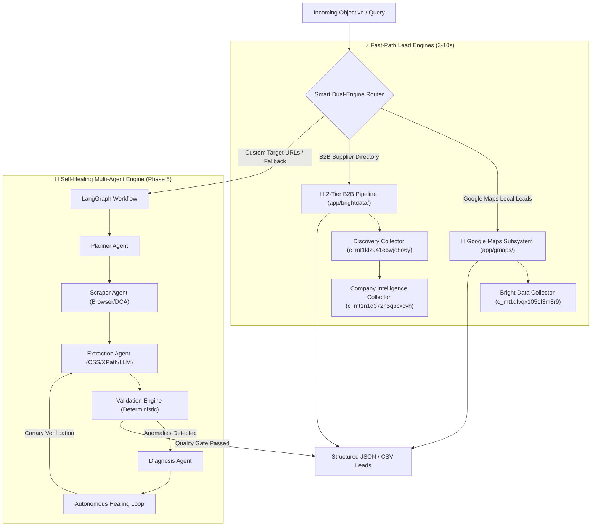

# Scrape the Verse 🌌

[](tests/)
[](https://www.python.org/)
[](https://fastapi.tiangolo.com/)
[](https://langchain-ai.github.io/langgraph/)
[](https://brightdata.com/)

An enterprise-grade, autonomous, self-healing web scraping framework & multi-agent lead intelligence system. Powered by **LangGraph**, **Ollama (local Qwen3:8b)**, **Playwright**, and **Bright Data Scraper Studio**.

---

## 🌟 Key Capabilities & Engines



---

## 🚀 Quick Start

### 1. Installation
```bash
# Clone the repository
git clone https://github.com/your-username/Scrape_the_Verse.git
cd Scrape_the_Verse

# Create and activate virtual environment
python -m venv .venv
.venv\Scripts\activate   # Windows
source .venv/bin/activate # macOS/Linux

# Install dependencies
pip install -r requirements.txt
playwright install chromium
```

### 2. Environment Configuration
Copy `.env.example` to `.env` and fill in your keys:
```bash
cp .env.example .env
```

```ini
# Bright Data Configuration
BRIGHTDATA=True
BRIGHTDATA_API_KEY=your_api_key_here
BRIGHTDATA_DISCOVERY_COLLECTOR_ID=c_mt1klz941e6wjo8o6y
BRIGHTDATA_COMPANY_COLLECTOR_ID=c_mt1n1d372h5qpcxcvh
BRIGHTDATA_GMAPS_COLLECTOR_ID=c_mt1qfvqx1051f3m8r9

# Scraper Provider mode: 'auto' (recommended), 'brightdata', or 'local'
SCRAPER_PROVIDER=auto

# Ollama Local LLM (for native engine & selector self-healing)
OLLAMA_BASE_URL=http://localhost:11434
OLLAMA_MODEL=qwen3:8b
```

---

## 🛠️ CLI Usage & Lead Generation

### 1. Google Maps Local Lead Discovery (`--maps`)
Extract verified businesses, ratings, review counts, direct phone numbers, and websites from Google Maps:
```bash
# Extract plumbers in Chennai and export to CSV
python cli.py "plumbers in Chennai" --maps -o plumbers_chennai.csv -f csv

# Extract carpenters in Bangalore
python cli.py "carpenters in Bangalore" --maps
```

### 2. 2-Tier B2B Lead Generator (`--leads`)
Extract wholesale suppliers, manufacturers, contact proprietors, GSTIN, and registration years:
```bash
# Extract solar panel manufacturers and save to CSV
python cli.py "solar panels in Delhi" --leads -o solar_leads.csv -f csv

# Extract packaging box suppliers
python cli.py "packaging boxes in Mumbai" --leads
```

### 3. Verify Health & Collectors (`--check-brightdata`)
```bash
python cli.py --check-brightdata
```

---

## 🤝 Integration Guide for Collaborators & External Projects

If a teammate or external application wants to pull and integrate with **Scrape the Verse**, they can interact via **Python Code Imports**, **Agent-to-Agent Delegation**, or the **REST API**.

### Option A: Direct Python Module Import

#### 1. Invoking Google Maps Leads Agent:
```python
import asyncio
from app.agents.gmaps import GoogleMapsAgent
from app.gmaps.service import GoogleMapsService
from app.models.schemas import ScrapingTask

async def fetch_local_contractors():
    # Direct Service Call
    gmaps = GoogleMapsService()
    leads = await gmaps.get_local_leads(query="electricians", location="Chennai")
    print(f"Found {len(leads)} local contractors")

    # Or via Agent-to-Agent Delegation
    agent = GoogleMapsAgent()
    task = ScrapingTask(
        task_id="team-task-001",
        objective="Find electricians in Chennai",
        target_urls=[]
    )
    result = await agent.execute_agent_delegation(task, source_agent="ExternalProjectSupervisor")
    print("Result records:", result.records)

asyncio.run(fetch_local_contractors())
```

#### 2. Invoking 2-Tier B2B Lead Generator:
```python
import asyncio
from app.brightdata.service import BrightDataService

async def fetch_b2b_suppliers():
    service = BrightDataService()
    # Chained 2-Tier: Discovery + Deep Company Profile Enrichment
    leads = await service.generate_leads(query="cnc machine suppliers", enrich_profiles=True)
    for lead in leads:
        print(f"Company: {lead['company_name']} | Contact: {lead['contact_person']} | GSTIN: {lead['gstin']}")

asyncio.run(fetch_b2b_suppliers())
```

#### 3. Invoking Full LangGraph Multi-Agent Workflow:
```python
import asyncio
from app.graph.workflow import create_scraping_workflow
from app.graph.state import ScrapingGraphState

async def run_full_graph():
    graph = create_scraping_workflow()
    
    initial_state = {
        "task_id": "workflow-job-123",
        "original_user_query": "Extract pricing from product table",
        "target_urls": ["https://news.ycombinator.com"],
        "scraper_provider": "auto",
        "repair_history": [],
        "repair_attempt": 0,
    }
    
    final_state = await graph.ainvoke(initial_state)
    print("Workflow Output:", final_state["final_output"])

asyncio.run(run_full_graph())
```

---

### Option B: REST API Microservice

Start the FastAPI server:
```bash
python -m uvicorn app.main:app --host 0.0.0.0 --port 8000 --reload
```

#### 1. Google Maps Leads Endpoint
```http
POST /api/v1/gmaps/leads
Content-Type: application/json

{
  "query": "plumbers in Chennai"
}
```

#### 2. B2B Chained Lead Endpoint
```http
POST /api/v1/brightdata/leads
Content-Type: application/json

{
  "query": "solar panels in Rajasthan",
  "metadata": {
    "enrich": true
  }
}
```

#### 3. General Scraping & Smart Dual-Engine Router
```http
POST /scrape
Content-Type: application/json

{
  "query": "Extract product titles and prices",
  "target_urls": ["https://store.example.com/products"],
  "max_records": 50
}
```

---

## 🧠 State Management & Isolation Guarantees

Every scraping request operates under an isolated `ScrapingGraphState`:

```python
class ScrapingGraphState(TypedDict, total=False):
    task_id: str
    original_user_query: str
    scraping_task: Optional[ScrapingTask]
    target_urls: list[str]
    navigation_result: Optional[dict[str, Any]]
    scraper_provider: str
    scraper_id: Optional[str]
    raw_results: Optional[list[dict[str, Any]]]
    extracted_results: Optional[list[dict[str, Any]]]
    validation_result: Optional[dict[str, Any]]
    diagnosis_result: Optional[dict[str, Any]]
    repair_plan: Optional[dict[str, Any]]
    repair_history: list[dict[str, Any]]
    repair_attempt: int
    final_output: Optional[ScrapingResult]
```

### State Guarantees:
1. **Thread-Safe & Async Isolated:** State is scoped strictly per `task_id` (UUID4). No cross-session memory leakage.
2. **Circuit Breakers & Retries:** Bounded concurrency using asyncio semaphores (`MAX_BROWSER_CONCURRENCY=5`) and domain-level rate limiting.
3. **Database Checkpointing:** Long-running async background jobs are tracked in SQLite with WAL (Write-Ahead Logging) enabled.

---

## 🧪 Testing & Verification

Run the full automated test suite (242 tests):
```bash
pytest tests/ -k "not live" -v
```

Run Google Maps & B2B pipeline tests:
```bash
pytest tests/test_gmaps_pipeline.py tests/test_brightdata_pipeline.py -v
```

---

## 📁 Repository Structure

```
Scrape_the_Verse/
├── app/
│   ├── agents/             # Multi-agent implementations (Planner, Scraper, Extraction, Validation, Diagnosis, Healing, GoogleMaps)
│   ├── brightdata/         # Bright Data DCA REST API, CLI wrapper & B2B 2-Tier Pipeline
│   ├── gmaps/              # Standalone Google Maps Local Leads Discovery Subsystem
│   ├── graph/              # LangGraph state machine & workflow coordination
│   ├── healing/            # Phase 5 autonomous self-healing engine (Patcher, Executor, Evaluator)
│   ├── crawler/            # Playwright browser manager & stealth automation
│   ├── extraction/         # Modular CSS, XPath, Semantic, and LLM text extractors
│   ├── validation/         # Deterministic schema & completeness validation gates
│   ├── config/             # Pydantic settings & logging setup
│   └── main.py             # FastAPI entrypoint & smart routing
├── cli.py                  # Full-featured CLI interface (--leads, --maps, -o, -f)
├── tests/                  # Complete test suite (242 unit & integration tests)
├── .env.example            # Documented environment variable template
└── requirements.txt        # Production dependencies
```

---

## 📄 License
MIT License. Built with ❤️ for intelligent, resilient web automation.
